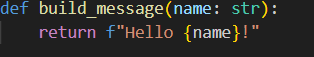
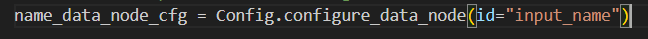
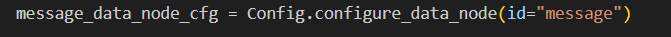
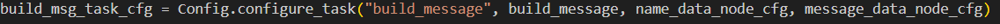
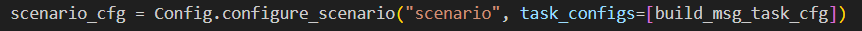
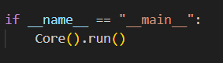
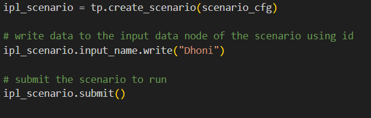
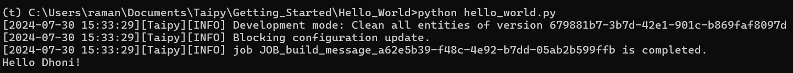

# **Hello World**

To create a basic **"Hello World"** example of a Taipy application, we perform the following three steps:

1. Configure Taipy Application
2. Create Taipy Application and Run the Scenario
3. Create Scenario and Access Data

## **1. Configure Taipy Application**

- To build the example, we need data nodes, tasks, and a scenario.
- Our goal is to print **"Hello {Name}"**.
- This logic to print can be defined under a function as shown below:

  

- The input to this function will be the name that comes from a data node.
- The output will be **"Hello {Name}"**, which will be consumed in another data node.
- To configure the two data nodes, we perform the following steps:

  
  

- Here in **id** we will provide the variable name for input and output data.
- We then configure the **TASK** which takes the function we defined earlier and two data nodes.

  

- Finally, we create a configuration for scenario which will take the tasks defined to be executed under the scenario

  

## **2. Create Taipy Application and Run the Scenario**

- Run as Core Service inside main function .
- This process will set up necessary variables to use Core functionalities.

  

## **3.Creating Scenarios and accessing data**

- We can intialize new scenario from the scenario configuration .
- We write "Dhoni" to the input data node using id *input_name*
- Then the created scenario is submitted for execution.
- This submission triggers creation and execution of job where input data is read from input data node and is passed to **build_message()** function which in turn writes the result in output data node.
   
   

- Once the job is completed we can read the expected output from out data node using id **message**.

## **Output**

