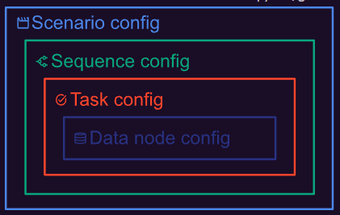
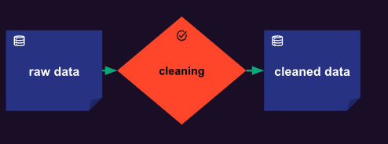
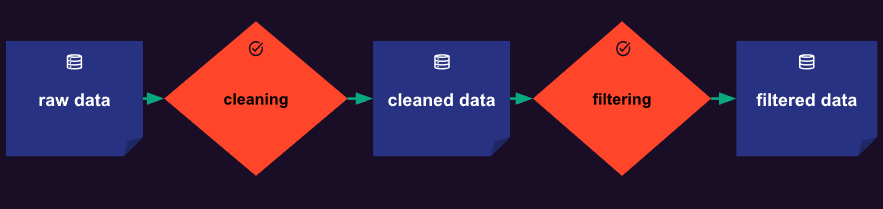
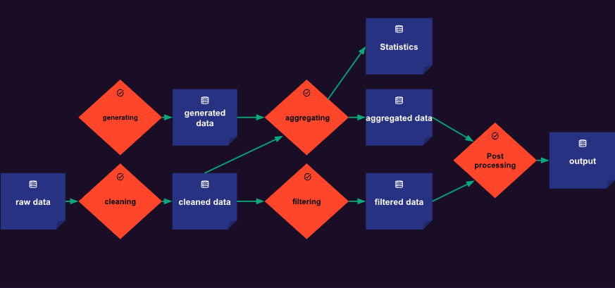

# **Taipy Documentation**

- Taipy is an application builder designed to help Python developers turn their data algorithms into an interactive production-ready data-driven application.

# **Taipy Core Concepts**

* **Data node** 

   - The Data node represents a reference to a dataset.
   - The Data can refer any type of data **[integer,string,dictionary,file,machine learning model,result of database query]**. 
   - The data node can be shared by multiple tasks as input or output.

* **Task**

  - The task can be seen as a function recieving data node as input and return data node as output.

* **Job**

   - Job is a unique execution of a task.

* **Scenario**

   - A Scenario represents a set of tasks connected through data nodes.
   - It forms a DAG[Directed Acyclic Graph] that should be executed as a whole.

* **Sequence**
  
   - A sequence represents a set of tasks connected through data nodes,that should be executed as a whole.
   - A sequence belongs to a scenario and can be thought of as a subgraph of the scenario's complete graph. 

* **Cycle**

   - A cycle is a time period with respect to an iteration of a recurrent business problem.
   - A cycle is defined as Frequency of scenarios.
   -  If scenarios have a weekly frequency, then each cycle represents a particular week, and every scenario will be attached to a particular cycle (i.e. a week).

* **Scope**

   - It represents the visibility of a data node and the level of its owner [Scenario,Cycle,Global]

## **Config vs Entities** 

- Data nodes,tasks and scenarios have two types of Taipy objects.
- They are called as configuration objects and runtime objects.
- The configuration objects are named configs (DataNodeConfig, TaskConfig, and ScenarioConfig). In contrast, the runtime objects (DataNode, Task, and Scenario) are called entities.
-  Configs are really just configuration objects describing the characteristics and the behaviors of the concepts they relate to.
- Each entity is instantiated from a config. Note also that the same config can be used to instantiate multiple entities.

# **Config Heirarchy**
  

# **Examples**

1. **Simple Single Function**

- Single cleaning function processing a single input, the raw data, and returning a single output, the cleaned data.

  

2. **Linear example with two functions**

- The first function cleaning processes a single input, the raw data, and returns some intermediate data named cleaned data. The second function filtering reads the same intermediate data cleaned data and returns a single output filtered data.

  

3. **Branching Example**

- This is a bit complex one.The function generating does not have any input. On the contrary, the function aggregating takes multiple inputs and returns multiple outputs.

  

