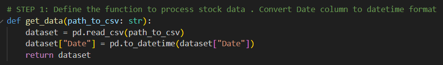
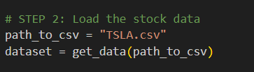
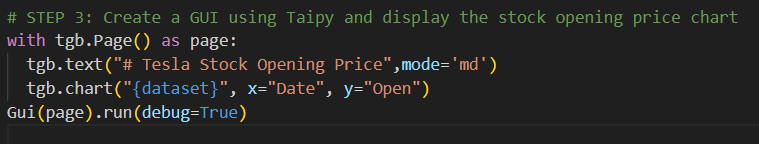
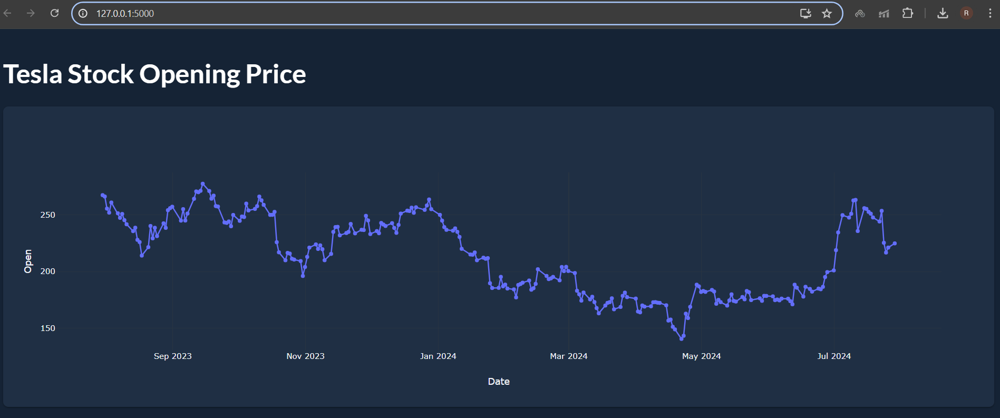

# **Create a simple data visualization app (e.g., a line chart of stock prices)**

**STEPS**
1. Define the function to process stock data . Convert Date column to datetime format
2. Load the stock data 
3. Create a GUI using Taipy and display the stock opening price chart

## **1. Define the function to process stock data . Convert Date column to datetime format**

- Here we define a function **get_data** which uses pandas csv reader to read input file.
- We convert the date column to datetime format

## **2. Load the stock data**

- Here we provide the path of our input file

## **3. Create a GUI using Taipy and display the stock opening price chart**

- We create a single page using gui builder library.
- We define the headline in markdown **[mode='md']** 
- We plot line chart using GUI builder charts where x axis is Date and Y axis is opening price of the stock.
- Finally we give our page to GUI function and run the script.
- Using debug=True will enable us to trace the origins of error if any.

## **WebPage**

- When the **viz_app.py** file is executed we will see a new window opening with the url **http://127.0.0.1:5000/** .
- Here 5000 is the default port number which can be modified.

## **Output**

